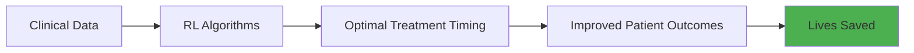

# Mohammad Mahdi Azarbeik

<div align="center">

```ascii
╔═══════════════════════════════════════════════════════════════╗
║  AI Researcher • Reinforcement Learning • Healthcare AI       ║
║  Building intelligent systems at the intersection of          ║
║  artificial intelligence and clinical decision support        ║
╚═══════════════════════════════════════════════════════════════╝
```

[](https://www.linkedin.com/in/mohammad-mahdi-azarbeik-757597201/)
[](https://scholar.google.com/citations?authuser=1&user=tVbfK3AAAAAJ)
[](mailto:mm.azarbeik@gmail.com)


</div>

---

## 🧬 Research DNA

I'm architecting the future of healthcare AI as a **Ph.D. candidate at TU Wien** and researcher at the **Ludwig Boltzmann Institute for Digital Health and Patient Safety** and **Medical University of Vienna**. My work transforms complex clinical challenges into intelligent, life-saving decision support systems.

**The Mission**: Deploy reinforcement learning algorithms in intensive care units where every decision counts, every second matters, and AI becomes a trusted clinical partner.

### 🎯 Current Research Impact



Working on **reinforcement learning for optimal timing of medical interventions** in critically ill patients—where machine learning meets medicine in the most critical moments.

---

## 🔬 Research Portfolio

<table>
<tr>
<td width="50%">

### 🧠 Core Expertise
- **Reinforcement Learning**  
  Sequential decision-making under uncertainty
  
- **Clinical AI**  
  ICU decision support & treatment optimization
  
- **Generative AI**  
  LLM hallucination detection & safety

</td>
<td width="50%">

### 🤖 Technical Domains
- **Robotics**  
  State estimation, SLAM, sensor fusion
  
- **Deep Learning**  
  Neural architectures for healthcare
  
- **NLP**  
  Medical text analysis & information extraction

</td>
</tr>
</table>

---

## 📊 Impact Metrics

<div align="center">

| 🎓 Academic | 💻 Technical | 🏥 Healthcare |
|:---:|:---:|:---:|
| **3+** Publications | **Python**, **PyTorch**, **TensorFlow** | **ICU Decision Support** |
| **Ph.D. Candidate** | **RL Algorithms** | **Patient Outcome Optimization** |
| **Teaching @ TU Wien** | **Deep Learning** | **Clinical Data Analysis** |

</div>

---

## 📚 Featured Publications

<details>
<summary><b>🏥 Optimal timing for renal replacement therapy using reinforcement learning</b></summary>
<br>
<i>Journal of Critical Care</i> (2025)<br>
Developing RL algorithms to determine optimal intervention timing for critically ill patients, potentially improving survival rates and reducing complications.
</details>

<details>
<summary><b>🤖 Augmenting inertial motion capture with SLAM using EKF and SRUKF</b></summary>
<br>
<i>Measurement</i> (2023)<br>
Advanced sensor fusion techniques combining inertial motion capture with SLAM for improved robotics state estimation.
</details>

<details>
<summary><b>🔍 TU Wien at SemEval-2024: Hallucination detection in LLMs</b></summary>
<br>
<i>SemEval-2024</i><br>
Unifying model-agnostic and model-aware approaches to detect and mitigate hallucinations in large language models.
</details>

**📖 [Complete Publication List →](https://scholar.google.com/citations?authuser=1&user=tVbfK3AAAAAJ)**

---

## 🛠️ Technical Arsenal

```python
class ResearcherProfile:
    def __init__(self):
        self.languages = ["Python", "MATLAB", "SQL"]
        self.ml_stack = {
            "frameworks": ["PyTorch", "TensorFlow", "scikit-learn"],
            "specializations": ["Reinforcement Learning", "Deep Learning", "NLP"],
            "robotics": ["ROS", "Kalman Filtering", "SLAM", "Sensor Fusion"]
        }
        self.data_tools = ["PostgreSQL", "BigQuery", "Pandas", "NumPy"]
        self.infrastructure = ["GCP", "Linux (Ubuntu)", "Git", "Docker"]
    
    def current_focus(self):
        return "Optimizing clinical decision-making with RL algorithms"
    
    def impact_area(self):
        return "Healthcare AI • Intensive Care • Patient Safety"
```

---

## 🎓 Knowledge Transfer

**Teaching @ TU Wien**

Passionate about democratizing AI education and mentoring the next generation of researchers:

- 🧠 **Reinforcement Learning** — From theory to real-world applications
- 🎨 **Generative AI** — Large language models and creative AI systems
- 💻 **Data-oriented Programming** — Modern paradigms for data science

---

## 🌱 Growth Trajectory

Currently exploring cutting-edge techniques in:

```diff
+ Multi-agent reinforcement learning systems
+ LLM alignment, safety, and interpretability
+ Real-time clinical decision support deployment
+ Federated learning for privacy-preserving healthcare AI
```

---

## 🏢 Professional Journey

**🔬 Researcher** — Medical University of Vienna *(Jul 2025 – Present)*  
Advancing AI applications in clinical settings

**🔬 Researcher** — Ludwig Boltzmann Institute DHPS *(Feb 2025 – Present)*  
Digital health and patient safety research

**👨‍🏫 University Assistant** — TU Wien *(Oct 2023 – Jan 2025)*  
Research and teaching in AI and machine learning

---

## 🤝 Collaboration Opportunities

I'm actively seeking collaborations in:

- 🏥 **Healthcare AI**: Clinical decision support, patient outcome prediction
- 🧠 **Reinforcement Learning**: Novel algorithms, real-world applications
- 🤖 **Robotics**: Autonomous systems, sensor fusion
- 🔬 **Interdisciplinary Research**: At the intersection of AI and medicine

**Let's build something impactful together!**

---

## 📫 Connect With Me

<div align="center">

| Platform | Link | Purpose |
|:---:|:---:|:---|
| 💼 | [LinkedIn](https://www.linkedin.com/in/mohammad-mahdi-azarbeik-757597201/) | Professional networking |
| 📧 | [mm.azarbeik@gmail.com](mailto:mm.azarbeik@gmail.com) | Direct communication |
| 🎓 | [Google Scholar](https://scholar.google.com/citations?authuser=1&user=tVbfK3AAAAAJ) | Research publications |

</div>

---

<div align="center">

### 💭 Research Philosophy

*"In the critical care unit, every algorithm has the potential to save a life.  
At the intersection of AI and healthcare, we're not just writing code—  
we're writing the future of medicine."*

---

**⭐ If you find my research interesting, consider starring my repositories!**


</div>
